# Dashboard Previews

Screenshots of every chart across the four dashboards, generated from the actual dataset. To run the app yourself, see the [setup instructions in README.md](README.md#setup--installation).

> **Re-generate screenshots** at any time by running `python generate_screenshots.py` from the project root.

---

## Dashboard 1 — Sales Analytics

**Path:** `/` · **Filters:** Category, Region

Covers store and e-commerce revenue performance across FY 2024. The category and region dropdowns cascade into all six charts on the page.

---

### Weekly Revenue & Gross Margin % Trend

Dual-axis line chart — weekly net revenue (filled area, left axis) and gross margin % (dotted line, right axis). Useful for spotting seasonal peaks, holiday lifts, and whether margin is holding during promotional weeks.

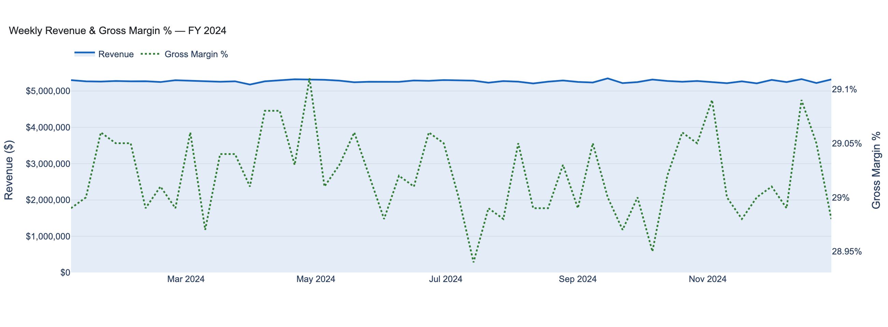

---

### Revenue by Category

Horizontal bar sorted by total revenue. Color intensity scales with revenue volume.

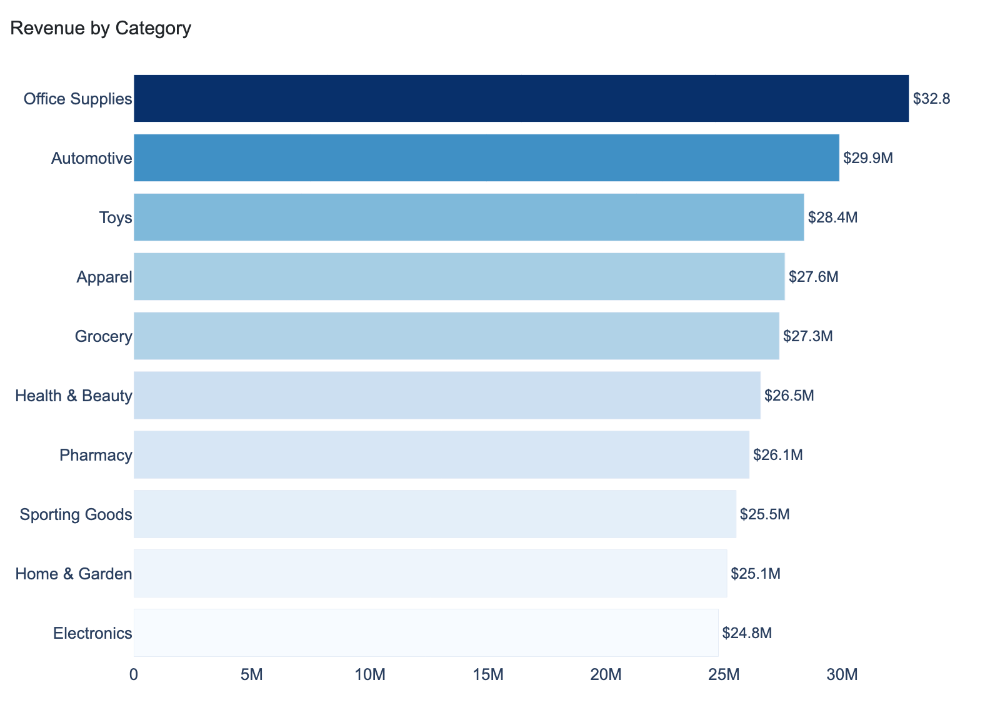

---

### Top 15 Items by Revenue

Each bar is color-coded by gross margin % — red for low-margin items, green for high-margin. Quickly shows which high-revenue items are also margin-efficient vs which ones are dragging the portfolio.

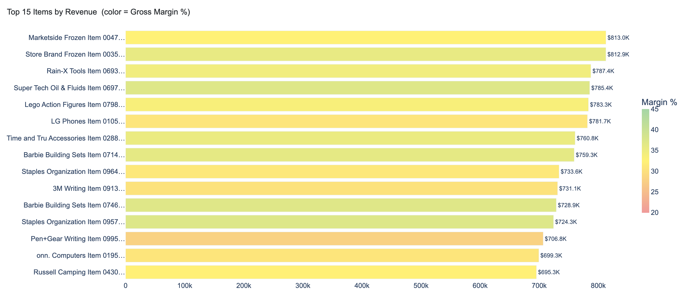

---

### In-Store vs E-Commerce Revenue

Stacked area chart comparing weekly in-store and e-commerce net sales across the year.

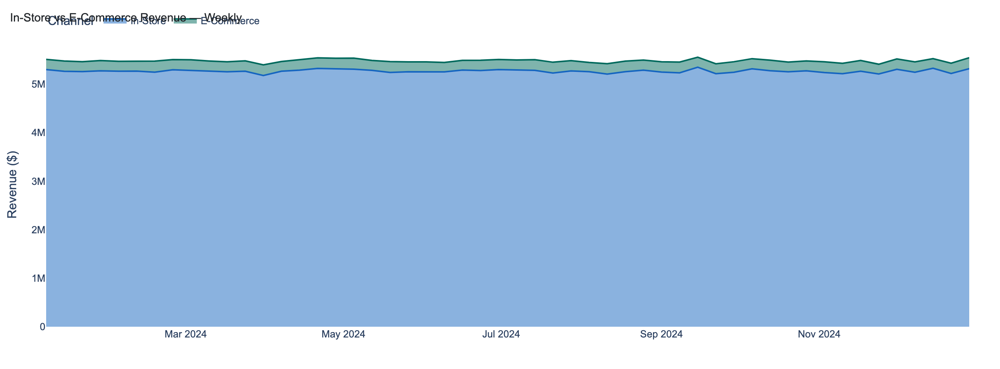

---

### Store Revenue vs Gross Margin % by Region

Each point is one store, sized by unit volume and colored by region. Useful for identifying regional clusters, outliers, and stores that generate high revenue but compress margin.

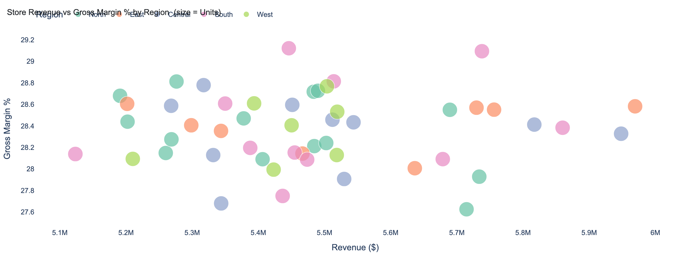

---

### Markdown Event Impact

Bars show total units sold per markdown type (Competition, Clearance, Promotion, Rollback, Seasonal). The amber line overlays the average markdown depth % so you can compare how aggressive each event type was versus how much volume it actually moved.

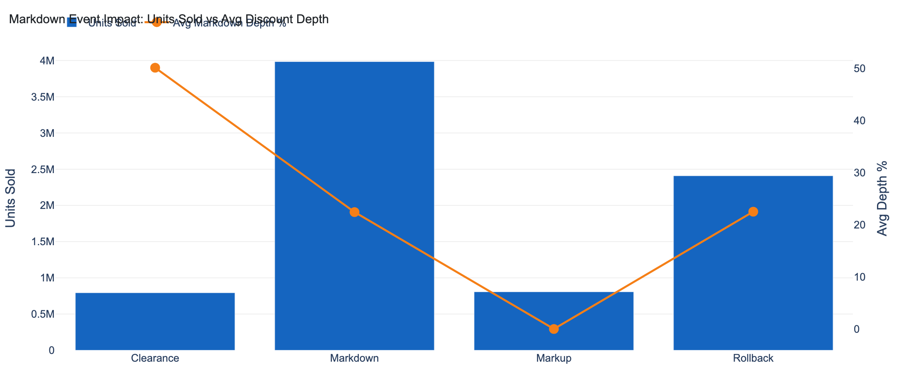

---

## Dashboard 2 — Supply Chain Intelligence

**Path:** `/supply-chain` · **Filter:** Vendor

Covers delivery performance, inventory health, demand forecasting accuracy, and purchase order tracking.

---

### OTIF Performance Trend

Weekly OTIF %, On-Time %, and In-Full % plotted over the full year. The dashed red line marks the 95% target. Dips during peak shipping periods and holiday quarters are clearly visible.

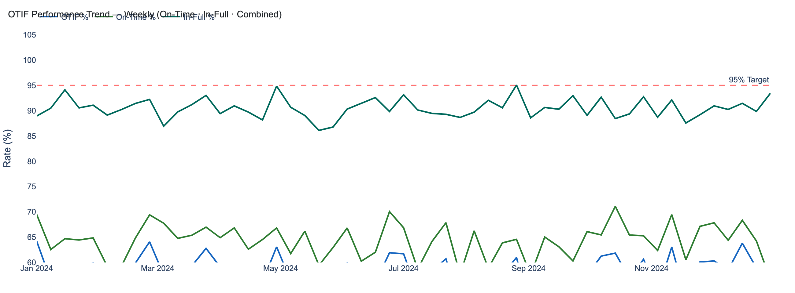

---

### Vendor OTIF Scorecard

Bottom 15 vendors by OTIF rate. Bars are color-coded: green ≥ 95%, amber 85–94%, red < 85%. The dashed vertical line marks the 95% target. Hover shows fill rate and total PO count per vendor.

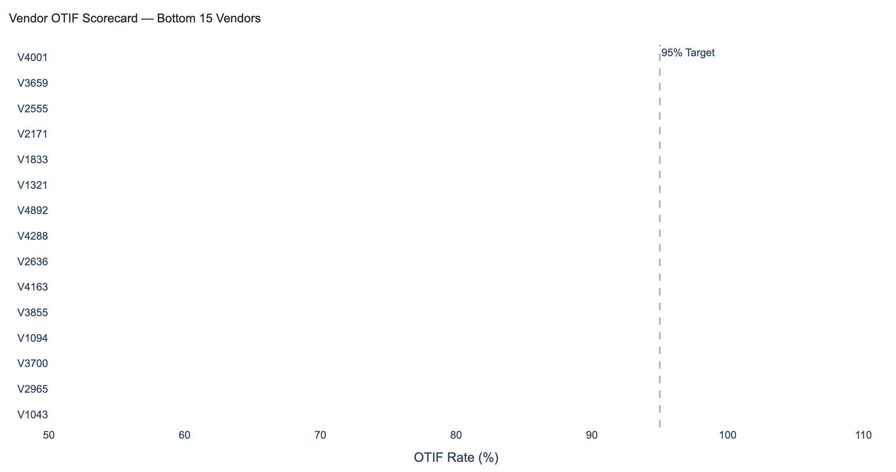

---

### Avg Days of Supply by Category

Bars are color-coded by urgency: red if < 7 days, amber if < 14 days, green otherwise. Reference lines mark the 7-day minimum and 14-day operational target.

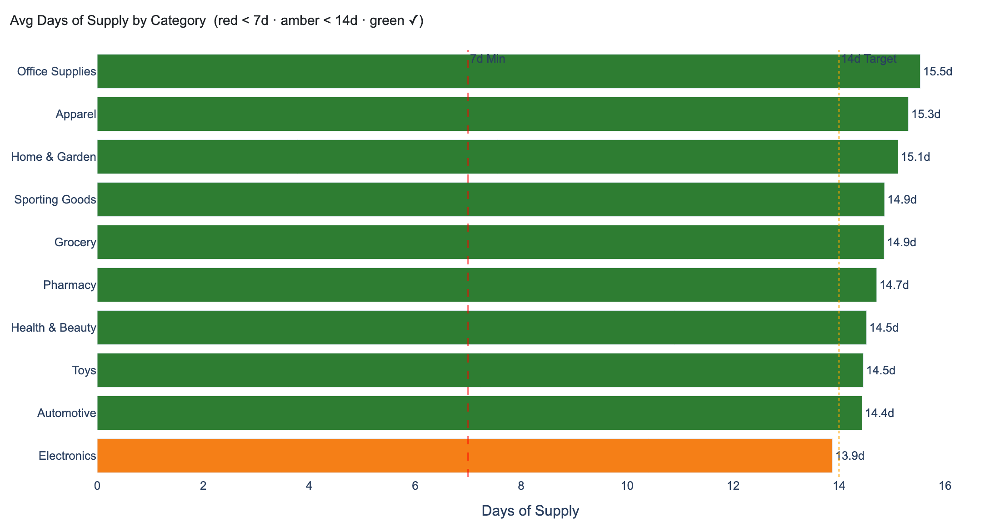

---

### Out-of-Stock Rate by Category

Heatmap bar chart with a green-to-red scale. The 15% dashed threshold line flags categories needing restocking action.

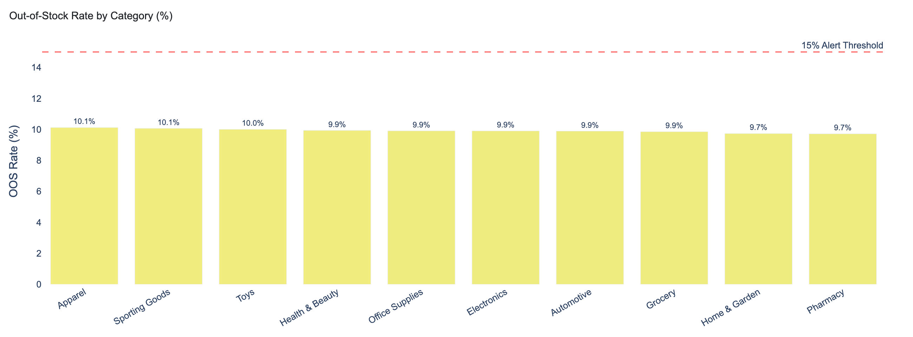

---

### Demand Forecast Accuracy

Dual-axis chart: MAPE % (filled area) and forecast accuracy % (dotted line) over time. Spikes in MAPE align with promo events or unexpected demand shifts.

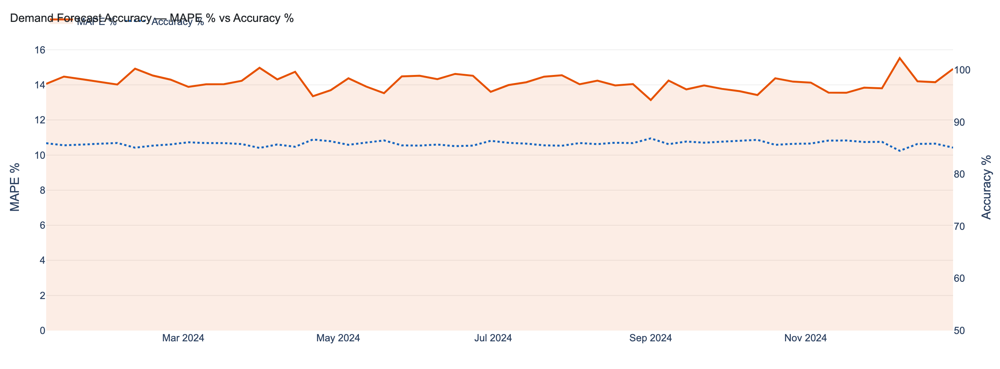

---

### Purchase Order Status Distribution

Donut showing the breakdown of all POs by status: Open, Confirmed, Shipped, Received, Cancelled.

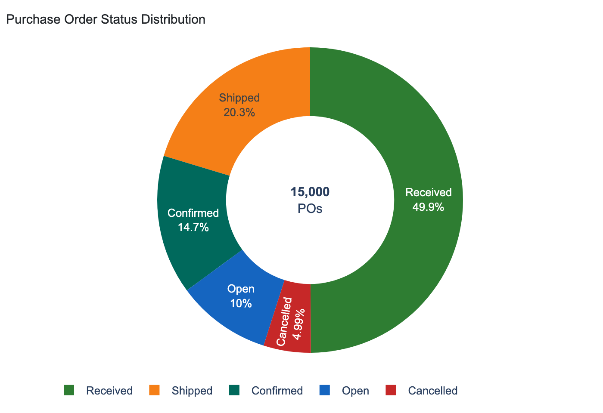

---

## Dashboard 3 — Shopper Behavior Analytics

**Path:** `/shoppers` · **Filters:** Device Type, Referral Source

Uses clickstream events, payment tender records, and fulfillment data to understand how shoppers browse, convert, and choose delivery options.

---

### Shopper Purchase Funnel

Funnel from Search down to Checkout showing absolute counts and drop-off % at each stage.

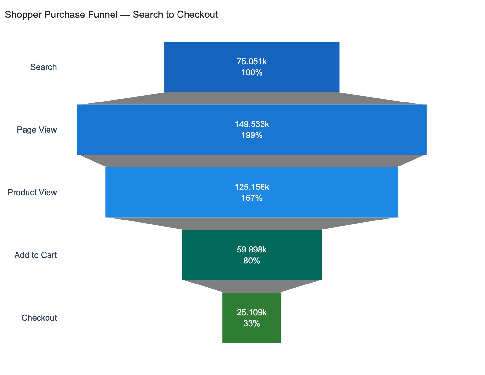

---

### Sessions by Referral Source & Device Type

Stacked bars per referral source (Google Search, Direct, Social, Email, Affiliate), broken out by device: Mobile (blue), Desktop (teal), Tablet (amber).

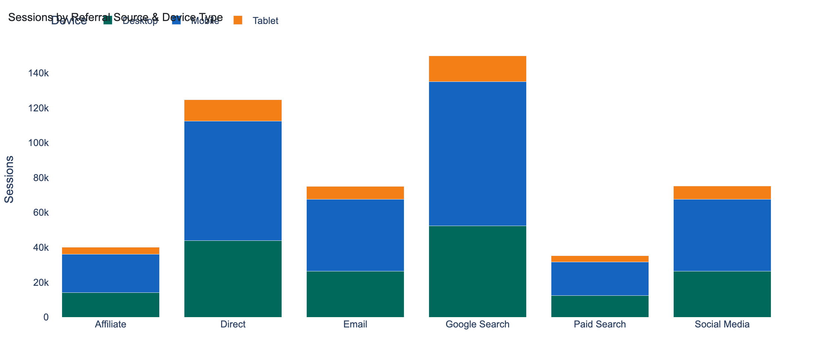

---

### Top 15 Search Terms

Most frequent search terms entered on the site. Useful for identifying high-intent keywords that may have low product availability or poor search result relevance.

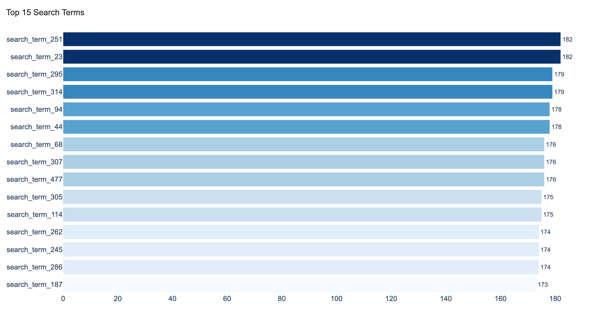

---

### Category Browse-to-Purchase & Add-to-Cart Conversion Rates

For each page category, two bars show the purchase conversion rate and the add-to-cart rate side by side. Categories are sorted by conversion rate descending.

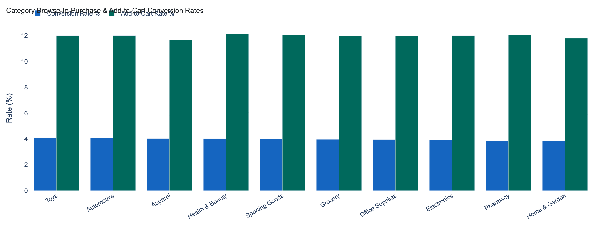

---

### Payment Tender Mix

Donut showing dollar-volume share across all tender types: Credit Card, Debit Card, Cash, EBT/SNAP, Gift Card, Mobile Pay, and Check.

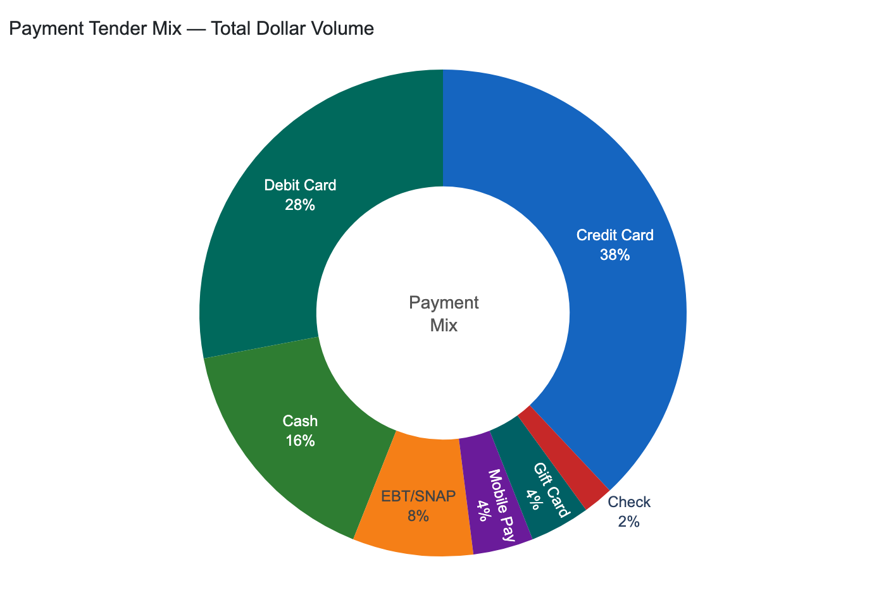

---

### Fulfillment Type: Order Volume, SLA Attainment & Customer Rating

Bars show order count per fulfillment type. The green diamond line tracks SLA met % and the amber dotted line tracks average customer star rating — so you can see where volume, reliability, and satisfaction align or diverge.

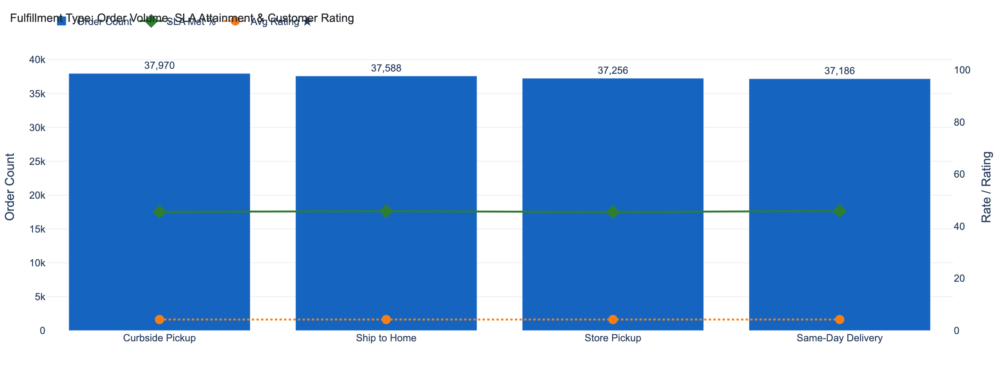

---

## Dashboard 4 — Category Manager · Supplier Portfolio

**Path:** `/category` · **Filters:** Retailer, Business Unit, Brand

Models the data a CPG supplier would use when managing their portfolio across retail accounts — covering market share, shelf execution, promotions, and consumer trends.

---

### Market Share Trend by Brand

Weekly dollar share % per brand over 52 weeks. Supplier-owned brands are solid lines; competitor brands are dashed. Retailer and brand filters narrow the view.

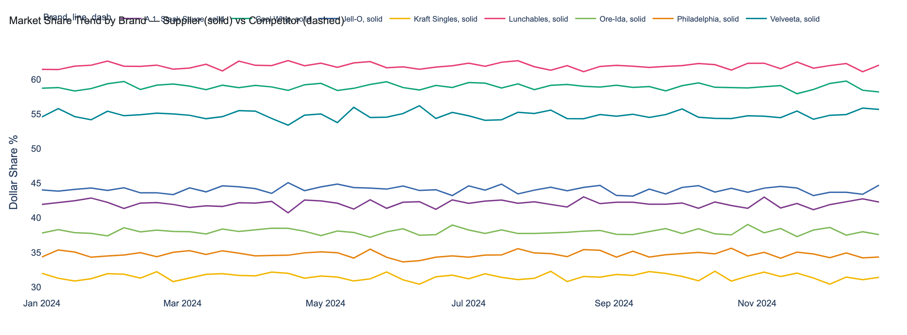

---

### Volume Decomposition Waterfall

Breaks the year-over-year change in net sales into five business drivers: Base Volume, Distribution, Velocity/Mix, Price, and Promotion. Green bars are positive contributors, red bars are negative. The final bar shows total net sales. Standard tool in category management for explaining what drove a result.

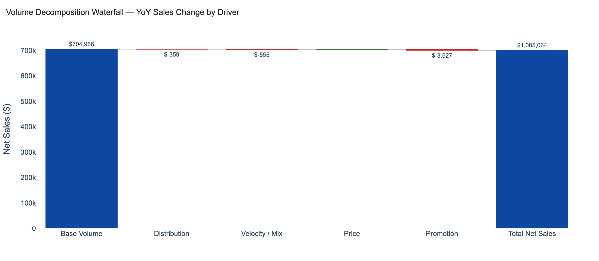

---

### Promo ROI: Store Compliance vs Volume Lift

Each bubble is a brand-promo type combination. X-axis = % of stores that actually ran the promotion. Y-axis = volume lift factor vs baseline. Bubble size = total promo spend. The best-performing promotions sit top-right (high compliance, high lift). Events in the bottom-left are spending without reaching enough stores.

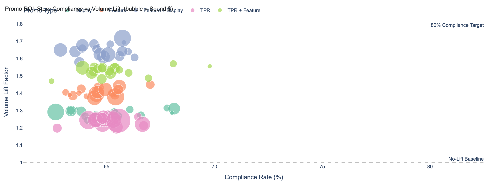

---

### Shelf Compliance by Retailer & Category

Three grouped bars per retailer-category: Facing Compliance %, Planogram Compliance %, and On-Shelf Availability %. The 90% target line is shown as a dashed reference.

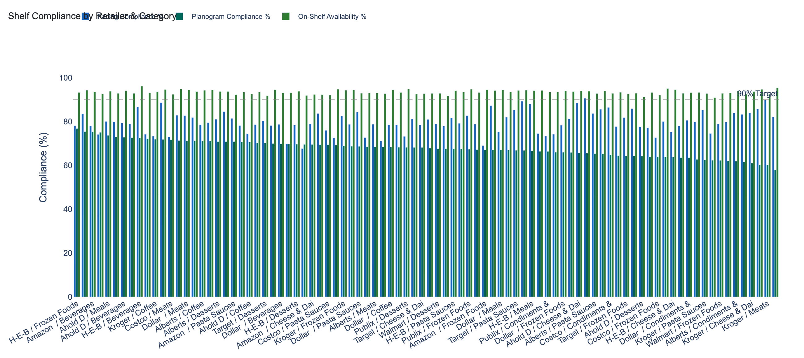

---

### Consumer Panel — Household Penetration % by Brand

Monthly household penetration for the top brands. Rising penetration signals new buyers entering the franchise; declining penetration means lapsed buyers are not being replaced.

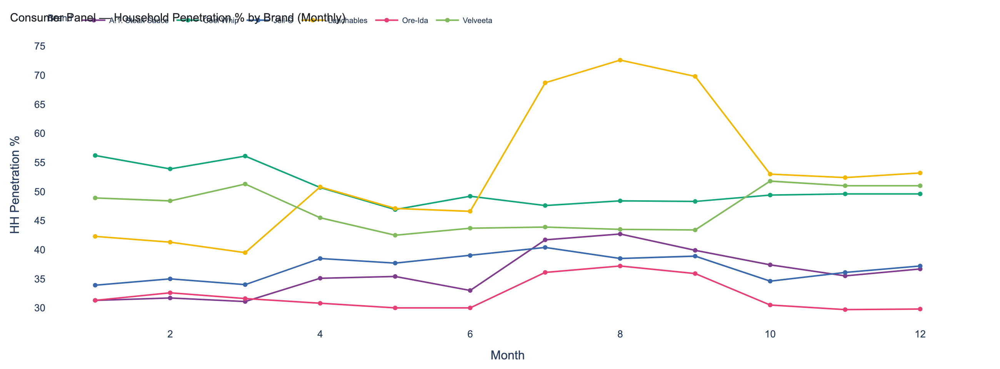

---

### Distribution ACV Gap — Coverage vs Opportunity

Each point is a SKU-retailer combination. X-axis = current ACV distribution %. Y-axis = ACV gap (how much more ACV is available if the item were fully distributed). Bubble size = TDP. Items in the top-left are under-distributed with large untapped opportunity — the priority list for the sales team.

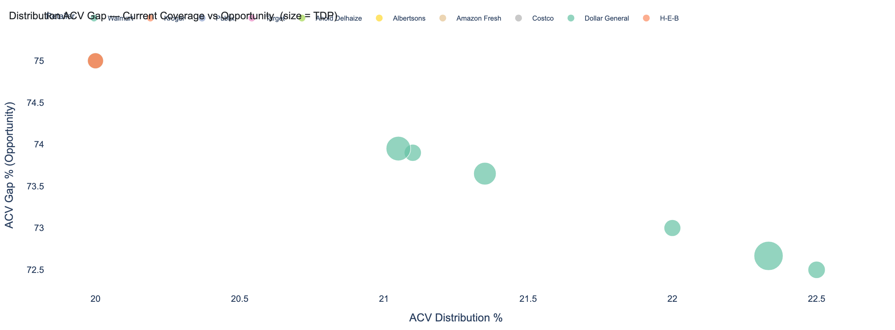

---

## Data Summary

| Dashboard | Primary Tables | Approx. Rows |
|---|---|---|
| Sales Analytics | `fact_store_sales`, `fact_ecomm_sales`, `fact_store_markup_markdown` | ~713K |
| Supply Chain | `fact_otif`, `fact_store_inventory`, `fact_store_demand_forecast`, `fact_purchase_order` | ~707K |
| Shopper Behavior | `fact_clickstream`, `fact_tender_analysis`, `fact_online_pickup_delivery` | ~778K |
| Category Manager | `fact_weekly_sales`, `fact_market_share`, `fact_volume_decomp`, `fact_promotional_events`, `fact_shelf_compliance`, `fact_distribution`, `fact_consumer_panel` | ~109K |

All data is synthetic. See [README.md](README.md) for the full dataset reference.
